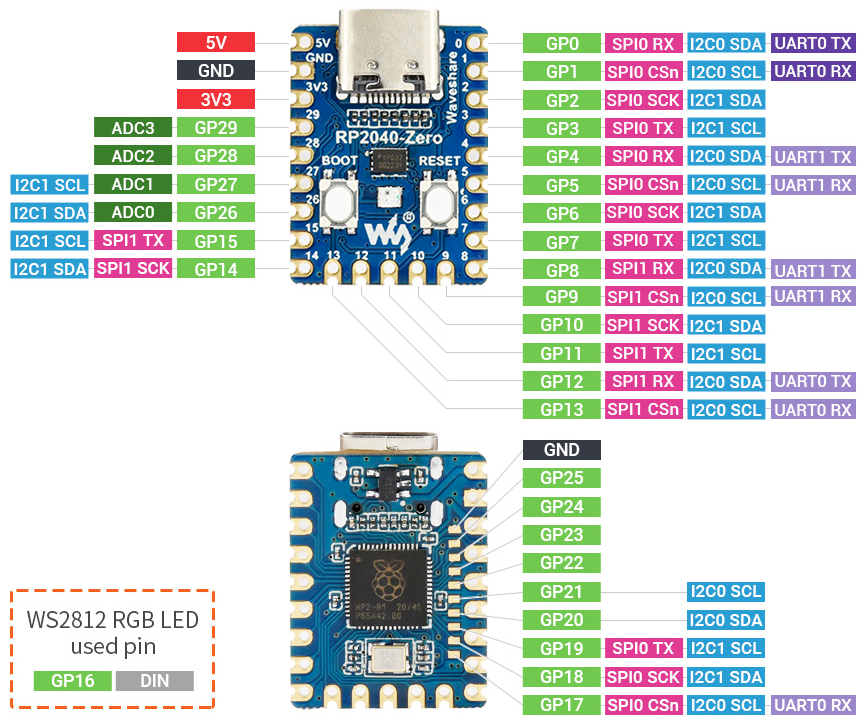

### Description:
The code is to demo the usage of nRF24L01+ 2.4Ghz chips to communicate between two rp2040-zero micro-controllers. 
### Source code:
- nrf24l01.py - driver class
- nrf24_send_example.py - example code to send a message
- nrf24_receive_example.py - example code to receive a message
### The hardware:

- [NRF24L01+ Wireless Transceiver Module2.4G Wireless Transceiver Module](https://www.amazon.com/dp/B00LX47OCY?ref_=ppx_hzsearch_conn_dt_b_fed_asin_title_14)
- [RP2040-Zero Boards (Generic RP2040 Microcontroller)](https://www.amazon.com/dp/B0FND59TMH?ref_=ppx_hzsearch_conn_dt_b_fed_asin_title_3)

### The PIN mapping:

- GP0/ SPI0 RX  <-> CE
- GP1/ SPI0 CSn <-> CSN
- GP2/ SPI0 SCK <-> SCK
- GP3/ SPI0 TX  <-> MOSI
- GP4/ SPI0 RX  <-> MISO
- 3V3           <-> VCC
- GND           <-> GND

### Module Pinout:

